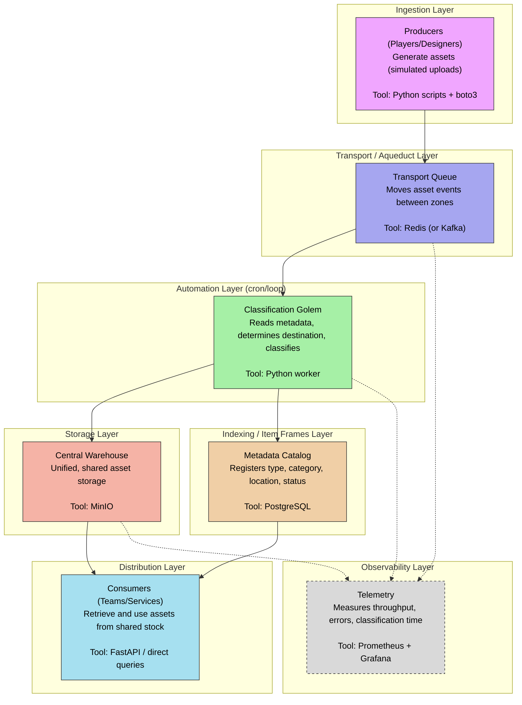

# Talos: Your automaton for Digital Supply Chains
A storage, classification, and telemetry system for digital assets, modeled as a supply chain: ingestion, transport, storage, automated classification, and distribution.

#### Project description
Every organization that produces digital assets at volume hits the same wall: assets scatter across ad hoc locations, nobody owns classification, and nobody can answer "where is this file" or "how long does it take to become usable." This isn't a small-team problem. Netflix and Spotify both invest heavily in internal data catalogs for exactly this reason - at scale, undiscoverable data is lost data, and lost data is lost engineering time.

Commercial DAM (Digital Asset Management) platforms like Adobe AEM or Bynder solve this for enterprises with enterprise budgets. This project builds the same category of system - open-source, self-hosted, and functional - proving that the core problem (production, transport, storage, classification, distribution) can be solved without a six-figure license.

#### Problem statement
- Assets are duplicated or misplaced across unstructured storage.
- No searchable record of what exists, where it lives, or its status.
- Classification is manual and doesn't scale with team size.
- No visibility into pipeline throughput, latency, or failure rate.

#### Architecture
Each node specifies layer, tool, and responsibility.

| Layer | Tool | Responsibility |
|---|---|---|
| Ingestion | Python + boto3 | Simulates producers writing assets into the system |
| Transport | Redis (or Kafka) | Decouples producers from the classification worker via an event queue |
| Classification | Python worker | Reads metadata, applies routing rules, moves assets without manual intervention |
| Storage | MinIO | Single S3-compatible storage backend, shared across consumers |
| Metadata catalog | PostgreSQL | Indexes asset type, category, location, and status |
| Distribution | FastAPI | Read access for consumers |
| Observability | Prometheus + Grafana | Throughput, error rate, classification latency |                                    
                                    
All components are open-source or free-tier, and the entire stack runs locally via Docker Compose.

#### Scope
The domain is simulated: synthetic digital assets (images, video, documents, 3D models, audio) generated by scripts standing in for multiple concurrent producers. This sidesteps the overhead of sourcing a real dataset while preserving the properties that actually stress the system: concurrent writes, heterogeneous asset types, and a classification step that has to make routing decisions without human input - the same shape of problem Netflix's data platform team or a mid-size creative agency's DAM would face, just scoped to run on a laptop.

#### What this demonstrates
- Data modeling for an asset metadata schema
- Event-driven pipeline design with decoupled producers and consumers
- Automated classification/routing logic
- Instrumentation and observability of a running pipeline
- Reproducible infrastructure

This is the same architectural pattern behind production data catalogs at companies like Netflix and Spotify, scoped down to something one engineer can build, run, and instrument in a week - which is precisely what makes it a strong case study: it's a working, observable system built on the same principles as the real thing.
